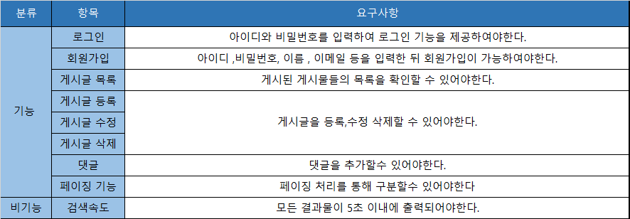
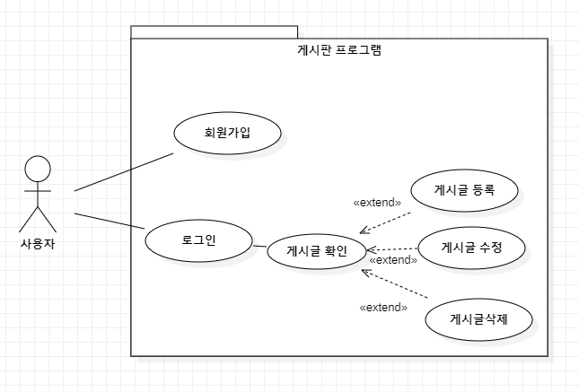
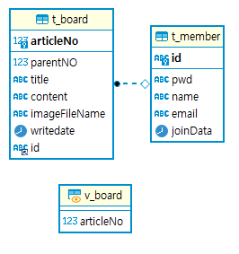
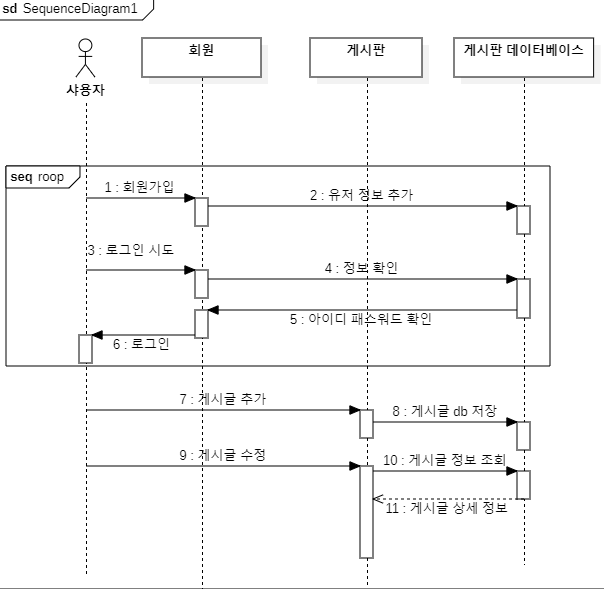
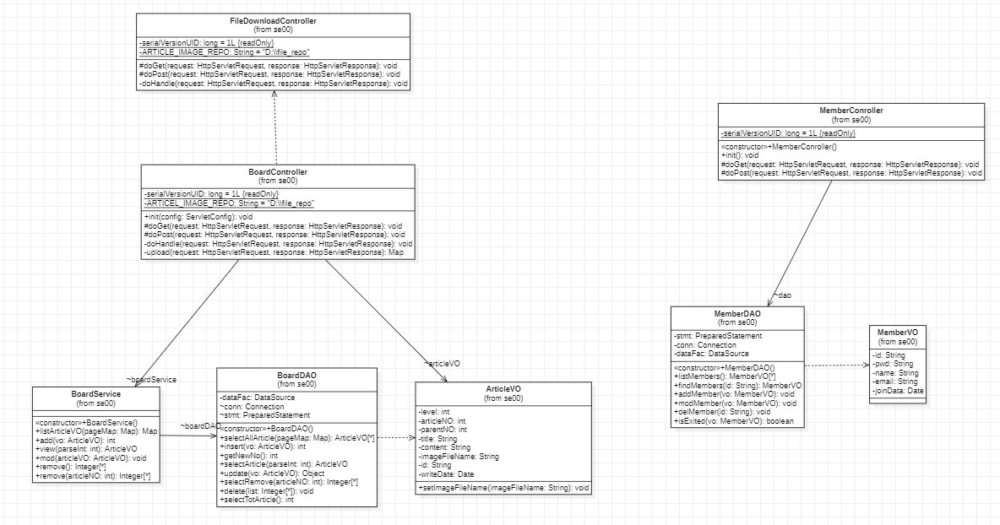
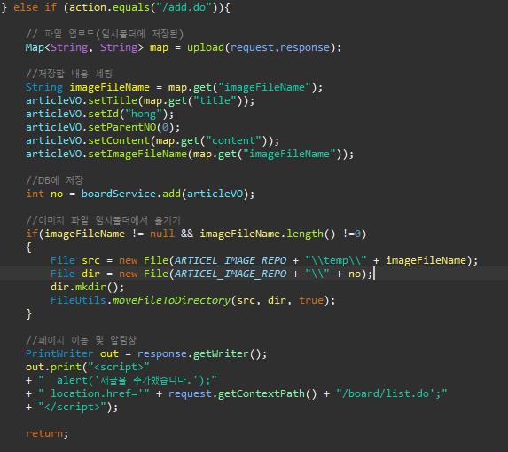
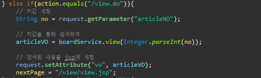
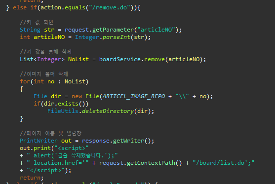

# 게시판 
***
## 프로그램 내용
게시판을 만들어 JSP, mvc2 패턴, js 등을 사용하여 프로그램이 어떻게 돌아가는지 이해하기위해 작성  
BoardController, BoardService, BoardDAO, jsp을 통해 mvc2 패턴을 이해하였으며  
FileDownloadController를 만들어 jsp에서는 어떻게 파일을 다운로드를 받는지 확인  
EL(${}),jstl의 지속적으로 사용을 통해 사용법을 익힘  
또한 오라클에서의 계층형쿼리와 마리아db의 계층형 쿼리를 작성하여 두 db에서의 차이점을 확인하였으며  
직접적으로 쿼리를 작성해보는것으로 계층형쿼리를 다루는법을 익힘  

### 사용 언어 및 기술
***
1. 언어 / 프레임워크 : Java 11, JSP, Servlet, JS, CSS
2. DB : mairadb
3. 개발툴 : 이클립스 jee
4. DB관리툴 : heidisql

### 요구사항 명세 

### 다이어그램 
1. 유스케이스 다이어그렘 

2. ER 다이어그렘 

3. 시퀀스 다이어그렘 

4. 클래스 다이어그렘 

### 핵심 소스코드
1. list 불러오기 
(./image/list.PNG)
2. 저장 

3. 읽기  

4. 삭제  

### 구현된 기능
*** 
1. 기본 CRUD(검색,추가,수정,삭제)
2. 페이징 기능
3. 댓글 쓰기

### 해결해야 할 문제
***
1. order by 가 목록이 늘어날수록 이상해질수 있음
2. 조회수 확인
3. 페이징 처리 계산이 정확하지 않은 부분이 존재(게시글이 10개일때 2페이지로 늘어나 2페이지를 누르더라도 건수가 나오지 않음)

### mariadb 계층형 관련 order by 내용 및 피드백 내용
###
1. order by가 목록이 늘어나면 늘어날수록 정렬이 제대로 안될 가능성이 농후하여 확인
참고 사이트
https://stackoverflow.com/questions/17737283/how-to-make-order-siblings-by
2. 하지만 작성 실패
3. topId가 생각하는 값으로 입력되지 않음
4. 추후 계층형, 재귀 관련하여 이해도가 증가하면 시도
