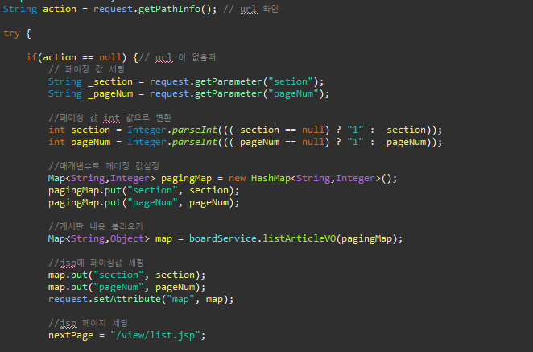

# 게시판 
***
## 개요
게시판을 만들어 JSP, mvc2 패턴, js 등을 사용하여 프로그램이 어떻게 돌아가는지 이해하기위해 작성

### 사용 언어 및 기술
***
1. 언어 / 프레임워크 : Java 11
2. DB : mairadb
3. 개발툴 : 이클립스 jee
4. DB관리툴 : heidisql

### 요구사항 명세

### 다이어그램
1. 유스케이스 다이어그렘

2. ER 다이어그렘

3. 시퀀스 다이어그렘

4. 클래스 다이어그렘

### 핵심 소스코드
1. list 불러오기

2. 저장

3. 읽기 

4. 삭제

### 구현된 기능
*** 
1. 기본 CRUD(검색,추가,수정,삭제)
2. 페이징 기능
3. 댓글 쓰기

### 해결해야 할 문제
***
1. order by 가 목록이 늘어날수록 이상해질수 있음
2. 조회수 확인
